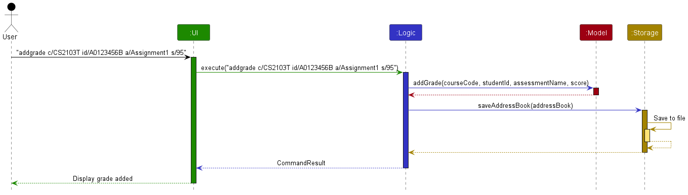
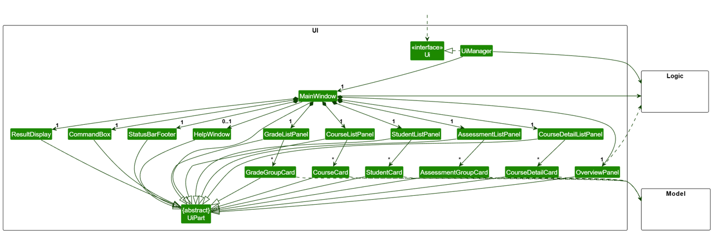
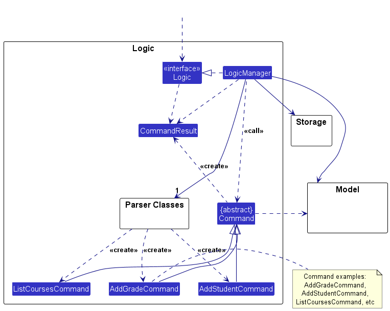
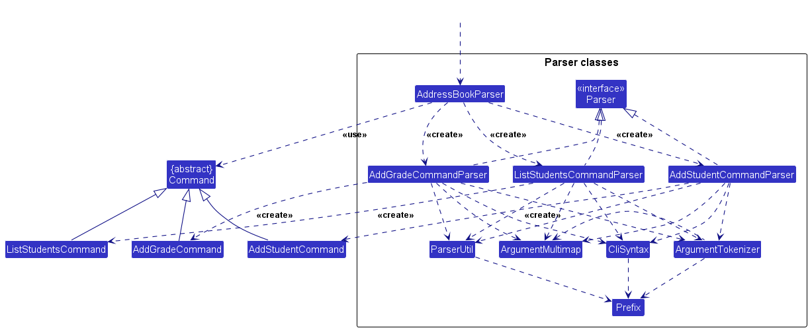
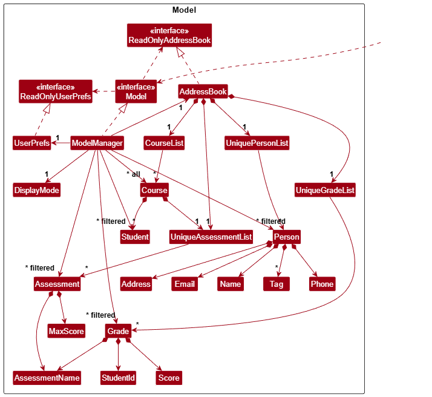
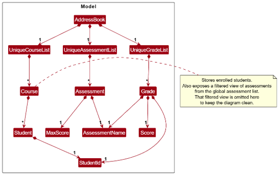
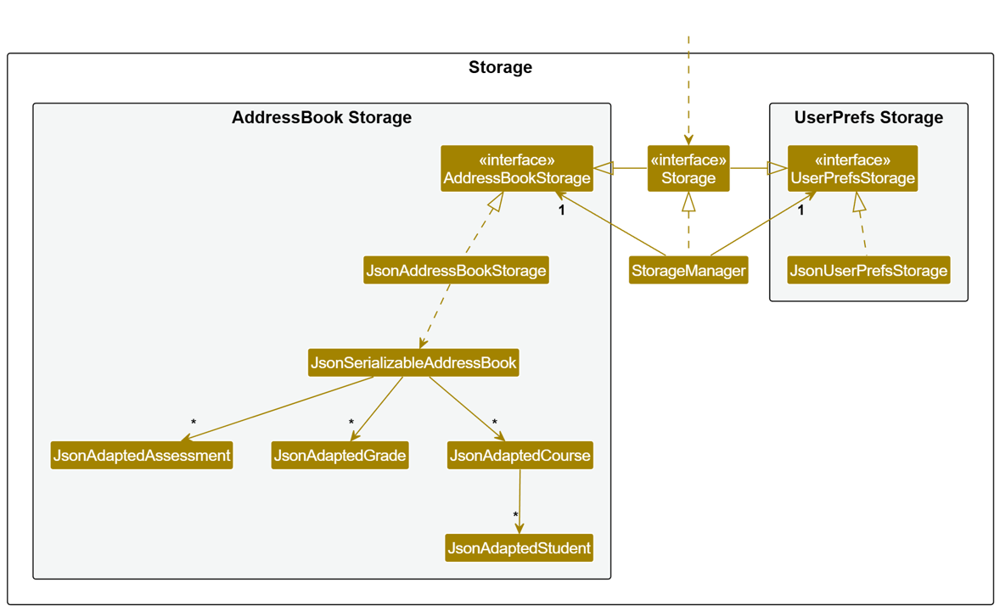
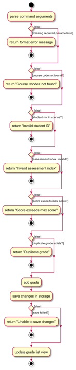
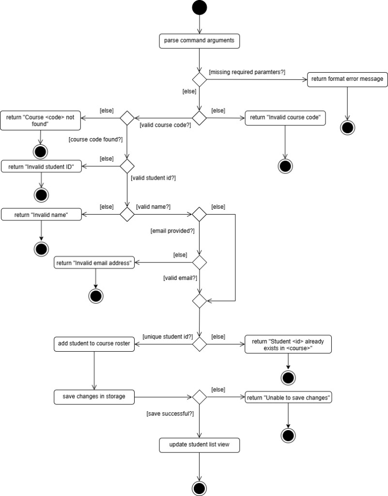

## Table of Contents

- [Acknowledgements](#acknowledgements)
- [Setting up, getting started](#setting-up-getting-started)
- [Design](#design)
  - [Architecture](#architecture)
  - [UI component](#ui-component)
  - [Logic component](#logic-component)
  - [Model component](#model-component)
  - [Storage component](#storage-component)
  - [Common classes](#common-classes)
- [Implementation](#implementation)
  - [Assessment management](#assessment-management)
  - [Grade management](#grade-management)
  - [Display mode driven UI switching](#display-mode-driven-ui-switching)
  - [Persistence after successful commands](#persistence-after-successful-commands)
- [Documentation, logging, testing, configuration, dev-ops](#documentation-logging-testing-configuration-dev-ops)
- [Appendix: Requirements](#appendix-requirements)
  - [Product scope](#product-scope)
  - [User stories](#user-stories)
  - [Use cases](#use-cases)
  - [Non-Functional Requirements](#non-functional-requirements)
  - [Glossary](#glossary)
- [Appendix: Planned Enhancements](#appendix-planned-enhancements)
- [Appendix: Effort](#appendix-effort)
- [Appendix: Instructions for manual testing](#appendix-instructions-for-manual-testing)
  - [Launch and shutdown](#launch-and-shutdown)
  - [Adding a course](#adding-a-course)
  - [Adding a student](#adding-a-student)
  - [Adding an assessment](#adding-an-assessment)
  - [Adding a grade](#adding-a-grade)
  - [Viewing the overall summary](#viewing-the-overall-summary)
  - [Saving data](#saving-data)

---

## **Acknowledgements**

- This project is based on the [AddressBook-Level3 project created by the SE-EDU initiative](https://github.com/se-edu/addressbook-level3). We adapted its architecture, code structure, documentation structure, and parts of its UI, logic, model, storage, testing, and configuration infrastructure for GradeBookPlus.
- The developer documentation and diagrams were adapted from the AddressBook-Level3 Developer Guide and the [se-edu/guides documentation](https://se-education.org/guides/).
- This project uses [JavaFX](https://openjfx.io/) for the graphical user interface.
- This project uses [Jackson](https://github.com/FasterXML/jackson) for JSON serialization and storage.
- This project uses [JUnit 5](https://junit.org/junit5/) for automated testing.
- This project uses [Gradle](https://gradle.org/) for build automation and dependency management.

---

## **Setting up, getting started**

Refer to the guide [_Setting up and getting started_](SettingUp.md).

---

## **Design**

:bulb: **Tip:** The `.puml` files used to create diagrams are in this document `docs/diagrams` folder. Refer to the [_PlantUML Tutorial_ at se-edu/guides](https://se-education.org/guides/tutorials/plantUml.html) to learn how to create and edit diagrams.

### Architecture

The **_Architecture Diagram_** given above explains the high-level design of the App.

Given below is a quick overview of main components and how they interact with each other.

**Main components of the architecture**

**`Main`** (consisting of classes [`Main`](https://github.com/AY2526S2-CS2103T-F12-3/tp/tree/master/src/main/java/seedu/address/Main.java) and [`MainApp`](https://github.com/AY2526S2-CS2103T-F12-3/tp/tree/master/src/main/java/seedu/address/MainApp.java)) is in charge of the app launch and shut down.

- At app launch, it initializes the other components in the correct sequence, and connects them up with each other.
- At shut down, it shuts down the other components and invokes cleanup methods where necessary.

The bulk of the app's work is done by the following four components:

- [**`UI`**](#ui-component): The UI of the App.
- [**`Logic`**](#logic-component): The command executor.
- [**`Model`**](#model-component): Holds the data of the App in memory.
- [**`Storage`**](#storage-component): Reads data from, and writes data to, the hard disk.

[**`Commons`**](#common-classes) represents a collection of classes used by multiple other components.

**How the architecture components interact with each other**

The _Sequence Diagram_ below shows how the main components interact when the user executes a command such as `removecourse c/CS2103`.

This diagram stays at the component level. The parser and command objects involved in the deletion flow are intentionally abstracted away here and are described in the `Logic` section below.

Each of the four main components shown in the diagram above,

- defines its _API_ in an `interface` with the same name as the component.
- implements its functionality using a concrete `{Component Name}Manager` class, which follows the corresponding API `interface` mentioned in the previous point.

For example, the `Logic` component defines its API in the `Logic.java` interface and implements its functionality using the `LogicManager.java` class, which follows the `Logic` interface. Other components interact with a given component through its interface rather than the concrete class, to prevent outside components from being coupled to the implementation of that component, as illustrated in the partial class diagram below.

The sections below give more details of each component.

### UI component

The **API** of this component is specified in [`Ui.java`](https://github.com/AY2526S2-CS2103T-F12-3/tp/tree/master/src/main/java/seedu/address/ui/Ui.java)

The UI consists of a `MainWindow` and several panel components, including `StudentListPanel`, `CourseListPanel`, `CourseDetailListPanel`, `AssessmentListPanel`, `GradeListPanel`, `OverviewPanel`, `CommandBox`, `ResultDisplay`, and `StatusBarFooter`. All these, including `MainWindow`, inherit from the abstract `UiPart` class.

The `UI` component uses the JavaFx UI framework. The layout of these UI parts are defined in matching `.fxml` files that are in the `src/main/resources/view` folder. For example, the layout of the [`MainWindow`](https://github.com/AY2526S2-CS2103T-F12-3/tp/tree/master/src/main/java/seedu/address/ui/MainWindow.java) is specified in [`MainWindow.fxml`](https://github.com/AY2526S2-CS2103T-F12-3/tp/tree/master/src/main/resources/view/MainWindow.fxml)

`MainWindow` keeps these list panels in a shared placeholder and toggles visibility/management based on `DisplayMode` (`STUDENTS`, `COURSES`, `COURSE_DETAILS`, `ASSESSMENTS`, `GRADES`, `OVERVIEW`).

The `UI` component,

- executes user commands using the `Logic` component.
- listens for changes to `Model` data so that the UI can be updated with the modified data.
- keeps a reference to the `Logic` component, because the `UI` relies on the `Logic` to execute commands.
- depends on `Model`-backed observable data to render courses, students, assessments, grades, and overview information.

### Logic component

**API** : [`Logic.java`](https://github.com/AY2526S2-CS2103T-F12-3/tp/tree/master/src/main/java/seedu/address/logic/Logic.java)

Here's a (partial) class diagram of the `Logic` component:

The diagram focuses on the core collaborators in `Logic`:

- `LogicManager` as the orchestrator for command execution
- `AddressBookParser` and concrete command parsers
- `Command` subclasses that execute business logic through the `Model`
- `CommandResult` as the output contract back to UI

The sequence diagram below illustrates the interactions within the `Logic` component, taking `execute("removecourse c/CS2103T")` as an example.

How the `Logic` component works:

1. When `Logic#execute(commandText)` is called, `LogicManager` logs the command and delegates parsing to `AddressBookParser`.
2. `AddressBookParser` identifies the command word and dispatches to the matching parser (for example, `RemoveCourseCommandParser`).
3. The concrete parser validates and parses arguments, then returns a concrete `Command` object (for example, `RemoveCourseCommand`).
4. `LogicManager` executes the command via `command.execute(model)`. For `removecourse`, the command validates the target course through the `Model`, removes the course, and resets the course-related display state.
5. After successful execution, `LogicManager` persists the updated state through `Storage#saveAddressBook(...)`.
6. `LogicManager` returns a `CommandResult` to the UI with the user-facing result message.

Here are the other classes in `Logic` (omitted from the class diagram above) that are used for parsing a user command:

How the parsing works:

- `AddressBookParser` acts as the entry point for parsing. It inspects the command word and delegates to a concrete parser such as `RemoveAssessmentCommandParser`, `AddCourseCommandParser`, `AddAssessmentCommandParser`, or `ExportCourseCommandParser`.
- Concrete parser classes implement the common `Parser<T>` interface and each creates exactly one matching `Command` subtype.
- Many parsers reuse shared helpers such as `ArgumentTokenizer`, `ArgumentMultimap`, `ParserUtil`, `CliSyntax`, and `Prefix` to tokenize prefixed arguments, validate them, and construct the target command object.
- Some simple commands, such as `help`, `exit`, and `viewall`, are instantiated directly by `AddressBookParser` and therefore do not appear in the parser class diagram.
- If command execution succeeds but persistence fails, `LogicManager` converts storage-layer exceptions into `CommandException` with user-facing file operation messages.

### Model component

**API** : [`Model.java`](https://github.com/AY2526S2-CS2103T-F12-3/tp/tree/master/src/main/java/seedu/address/model/Model.java)

The Model component is documented using two complementary diagrams:

1. **Model class overview diagram** (interfaces/managers/lists and high-level ownership)

2. **GradeBookPlus domain class diagram** (core domain entities and aggregate relationships)

The `Model` component,

- stores the application data, including courses, students, assessments, and grades.
- stores filtered observable lists used by the UI (for example filtered course, assessment, and grade lists) so the UI can react to model updates.
- stores a `UserPrefs` object that represents the user's preferences. This is exposed to other components as a read-only `ReadOnlyUserPrefs` view.
- does not depend on any of the other three components (as the `Model` represents data entities of the domain, they should make sense on their own without depending on other components)

### Storage component

**API** : `Storage.java`

The `Storage` component,

- persists both GradeBookPlus data and user preferences to disk in JSON format, and loads them back at startup.
- is orchestrated by `StorageManager`, which implements the `Storage` interface and delegates to:
  - `JsonAddressBookStorage` for application data (courses, students, assessments, and grades).
  - `JsonUserPrefsStorage` for GUI and file-path preferences.
- uses `JsonSerializableAddressBook` and `JsonAdapted*` classes as the JSON-to-model mapping layer.
- is invoked by `LogicManager` after successful command execution via `storage.saveAddressBook(model.getAddressBook())`.
- depends on `Model`-layer classes because storage serializes/deserializes domain objects owned by the model.

### Common classes

Classes used by multiple components are in the `seedu.address.commons` package.

`commons` is split into three main subpackages:

- `seedu.address.commons.core`: shared application-level value objects and infrastructure helpers.
  - `Config`: runtime configuration values (for example file paths and app parameters).
  - `GuiSettings`: window size/position preferences shared between UI and storage.
  - `Version`: centralized app version representation used across startup and UI display.
  - `LogsCenter`: centralized logger configuration/creation used by all components.
  - `Index` (`commons.core.index`): one-based/zero-based index helper used by parsers and commands.
- `seedu.address.commons.exceptions`: cross-component exception types.
  - `DataLoadingException`: wraps failures when loading persisted data.
  - `IllegalValueException`: indicates invalid values detected during conversion/parsing.
- `seedu.address.commons.util`: reusable utility methods for common operations.
  - `CollectionUtil`: null checks and collection-related helpers.
  - `FileUtil`, `ConfigUtil`, `JsonUtil`: file and JSON read/write helpers used heavily by `Storage`.
  - `StringUtil` and `ToStringBuilder`: formatting/string helper utilities used across model and logic.
  - `AppUtil`: small app-level utility helpers.

Design notes:

- Common classes are intentionally domain-agnostic and should not contain gradebook business rules.
- Components depend on `commons` for shared mechanics (logging, parsing helpers, serialization utilities), which reduces duplication while keeping domain logic inside `logic`, `model`, and `storage`.

---

## **Implementation**

This section describes key implementation details of GradeBookPlus features.

### Course management

Course commands are implemented through dedicated parser-command pairs:

- `AddCourseCommandParser` -> `AddCourseCommand`
- `RemoveCourseCommandParser` -> `RemoveCourseCommand`
- `ListCoursesCommandParser` -> `ListCoursesCommand`

Implementation behavior:

- Parser layer validates command shape and required prefixes before constructing the command object.
- `ParserUtil.parseCourseCodes` parses one or more comma-separated course codes into normalized command inputs.
- `AddCourseCommand` rejects duplicate course codes within the same command and prevents adding courses that already exist in the model.
- After successfully adding the requested courses, `AddCourseCommand` resets the course-related display state so the UI returns to the courses view.
- `RemoveCourseCommand` performs the complementary validation and removal flow for existing courses.

The sequence diagram below shows the high-level `addcourse` interaction through `Logic` and `Model`.

The activity diagram below summarizes the main validation and execution branches for `addcourse`.

### Assessment management

Assessment commands are implemented through dedicated parser-command pairs:

- `AddAssessmentCommandParser` -> `AddAssessmentCommand`
- `RemoveAssessmentCommandParser` -> `RemoveAssessmentCommand`
- `ListAssessmentsCommandParser` -> `ListAssessmentsCommand`

Validation is split by responsibility:

- Parser layer validates command shape and required prefixes.
- `ParserUtil` performs type/value parsing (`parseAssessmentName`, `parseMaxScore`).
- Command layer performs model-dependent validation (for example course existence, duplicate checks, and index bounds).

`RemoveAssessmentCommand` removes the assessment identified by its course code and assessment index. When an assessment is removed, all grades associated with that assessment are also removed.

### Grade management

Grade flows are similarly organized with parser-command pairs:

- `AddGradeCommandParser` -> `AddGradeCommand`
- `RemoveGradeCommandParser` -> `RemoveGradeCommand`
- `ListGradesCommandParser` -> `ListGradesCommand`

Implementation behavior:

- `ParserUtil.parseScore` parses and validates raw score input.
- `AddGradeCommand` validates course existence, student enrollment in the target course, assessment index validity, max-score constraint, and duplicate grade prevention before mutation.
- `RemoveGradeCommand` validates the same target tuple (course, student, assessment) and fails with a not-found message when no matching grade exists.
- `ListGradesCommand` supports filtered listing and updates model predicates used by the UI list views.

The sequence diagram below shows the end-to-end `addgrade` interaction through `Logic` and `Model`.

The activity diagram below summarizes the validation and execution branches for `addgrade`.

### Display mode driven UI switching

GradeBookPlus uses `DisplayMode` in the model to coordinate which major panel is shown in `MainWindow`.

- List/view commands set display mode explicitly (`COURSES`, `STUDENTS`, `COURSE_DETAILS`, `ASSESSMENTS`, `GRADES`, `OVERVIEW`).
- UI reads the current mode through `Logic` and toggles panel visibility/managed state accordingly.
- This keeps command handlers UI-agnostic while still enabling deterministic screen transitions after command execution.

### Persistence after successful commands

`LogicManager` persists application data after successful command execution by calling:

- `storage.saveAddressBook(model.getAddressBook())`

If persistence fails, the error is converted into a user-facing `CommandException`, so command semantics remain consistent from the user perspective.

---
## **Documentation, logging, testing, configuration, dev-ops**

- [Documentation guide](Documentation.md)
- [Testing guide](Testing.md)
- [Logging guide](Logging.md)
- [Configuration guide](Configuration.md)
- [DevOps guide](DevOps.md)

---

## **Appendix: Requirements**

### Product scope

**Target user profile**:

- Role: University-level academic educator teaching one or more undergraduate courses each semester

- Class size: Manages assessment records for classes ranging from dozens to a few hundred students

- Core tasks: Regularly updates grades after assignments, tests, and other assessments

- Work setup: Works primarily alone on a personal computer

- Responsibility: Maintains accurate, up-to-date grade records throughout the semester

- Pain points: Manual bookkeeping and repeated calculations are time-consuming and reduce time for teaching/student engagement

- Needs/values: Efficiency, clarity, and reduced administrative overhead

- Tech comfort: Comfortable using simple command-based tools if they speed up work and improve reliability

**Value proposition**: GradeBookPlus helps educators manage and interpret student assessment results by consolidating grades across assignments and tests into a single system, reducing manual record-keeping and enabling clearer insight into overall class performance and academic trends.

### User stories

Priorities: High (must have) - `* * *`, Medium (nice to have) - `* *`, Low (unlikely to have) - `*`

| Priority | As a …                            | I want to …                                               | So that I can…                                            |
| -------- | --------------------------------- | --------------------------------------------------------- | --------------------------------------------------------- |
| `*`      | potential user exploring the app  | see the app populated with sample data                    | easily see how the app will look like when it is in use.  |
| `* * *`  | first time user                   | view available commands                                   | understand how the application works.                     |
| `* *`    | new user                          | to test the available features                            | see an example of how the application works.              |
| `* * *`  | new user                          | start with a clean table                                  | not have extra unnecessary data                           |
| `* * *`  | new user                          | create a new course in the system                         | manage assessment records for each course separately      |
| `* * *`  | new user                          | add a list of students to a course using a single command | quickly initialize the class roster                       |
| `* * *`  | new user                          | edit student records                                      | keep my class list accurate throughout the semester       |
| `* * *`  | beginner user                     | remove student records                                    | keep my class list accurate when students drop the course |
| `* * *`  | user who teaches multiple courses | switch between courses                                    | view and update the correct class records quickly         |
| `* * *`  | user                              | add an assessment component                               | organize grades by assignments/tests/exams                |
| `*`      | user                              | edit an assessment component                              | reflect changes in assessment structure                   |
| `* * *`  | user                              | delete an assessment component                            | remove assessments that are no longer relevant            |
| `* * *`  | user                              | record a student’s grade for an assessment                | keep track of student performance                         |
| `*`      | user                              | update a student’s grade                                  | correct mistakes or reflect regrading                     |
| `* * *`  | user                              | view a student’s grade                                    | understand how they performed across assessments          |
| `*`      | user                              | view the overall grade for a student                      | quickly see their standing                                |
| `* * *`  | user                              | list recorded grades for a course                         | review the class performance at a glance                  |
| `* *`    | user                              | search for a student by name or ID                        | locate records quickly in a large cohort                  |
| `*`      | user                              | filter students by performance band                       | identify students who need attention or who excel         |
| `*`      | user                              | sort students by name or overall grade                    | navigate the records more efficiently                     |
| `*`      | user                              | compute weighted totals automatically                     | save time and reduce calculation errors                   |
| `*`      | user                              | set weightages for assessment components                  | ensure overall grades are computed correctly              |
| `*`      | user                              | see grade breakdown for a student                         | explain how an overall grade was derived                  |
| `* *`    | user                              | export grade data to CSV                                  | submit results or back up data                            |
| `*`      | user                              | import data from CSV                                      | reduce manual entry when setting up or migrating records  |
| `*`      | user                              | undo the last action                                      | recover from accidental edits                             |
| `* *`    | user                              | get clear error messages for invalid commands             | fix mistakes quickly without guessing                     |
| `*`    | user                                | see confirmation before deleting important data           | avoid accidental loss of records                          |
| `* *`    | user                              | save data automatically                                   | not lose progress if the app closes unexpectedly          |

### Use cases

(For all use cases below, the **System** is `GradeBookPlus` and the **Actor** is the `user`, unless specified otherwise)

**Use Case: Add a student**

The following activity diagram summarizes what happens when a user executes the `addstudent` command:

**MSS**

1. User requests to add a student to the list, including the course code (required), student ID (required), name
(required) and email (optional) in the command.
2. GradeBookPlus adds the student.

    Use case ends.

**Extensions**

* 2a. User inputs invalid course code.
  * 2a1. GradeBookPlus shows an error message.

    Use case ends.

* 3a. User inputs invalid student ID.
    * 3a1. GradeBookPlus shows an error message.

      Use case ends.

**Use case: Delete a student**

**MSS**

1. User requests to delete a specific student in the list, including the student's name and course code in the command.
2. GradeBookPlus deletes the student

    Use case ends.

**Extensions**

* 2a. The specified student cannot be found.
  * 2a1. GradeBookPlus shows an error message

    Use case ends.

* 3a. The given course code is invalid.

    * 3a1. GradeBookPlus shows an error message.

      Use case ends.

**Use case: Add a course**

**MSS**

1. User requests to add a course, including its course code
2. GradeBookPlus adds the new course

**Use case: Add a course assessment**

**MSS**

1. User requests to add an assessment to an existing course, including the course code, assessment name, and maximum score in the command.
2. GradeBookPlus adds the assessment to the specified course.

**Extensions**

* 1a. Command format is invalid, or one or more required fields are missing.
  * 1a1. GradeBookPlus shows "❌ Invalid command format!" followed by the correct `addassessment` command usage.

    Use case ends.

* 1b. Course code is invalid.
  * 1b1. GradeBookPlus shows "❌ Invalid course code. Example: c/CS2103T".

    Use case ends.

* 1c. Assessment name is invalid.
  * 1c1. GradeBookPlus shows "Assessment names should not be blank and should be at most 50 characters long."

    Use case ends.

* 1d. Maximum score is invalid.
  * 1d1. GradeBookPlus shows "Max score must be greater than 0 and at most 999, with at most 1 decimal place."

    Use case ends.

* 2a. Specified course cannot be found.
  * 2a1. GradeBookPlus shows "Course COURSE_CODE not found."

    Use case ends.

* 2b. Assessment already exists in the specified course.
  * 2b1. GradeBookPlus shows "This assessment already exists."

    Use case ends.

**Use case: Remove a course assessment**

**MSS**

1. User requests to remove an assessment from an existing course, including the course code and assessment index in the
command.
2. GradeBookPlus removes the assessment from the specified course.

**Extensions**

* 1a. Command format is invalid, or one or more required fields are missing.
  * 1a1. GradeBookPlus shows "❌ Invalid command format!" followed by the correct `removeassessment` command usage.

    Use case ends.

* 1b. Course code is invalid.
  * 1b1. GradeBookPlus shows "❌ Invalid course code. Example: c/CS2103T".

    Use case ends.

* 1c. Assessment index is not a non-zero unsigned integer.
  * 1c1. GradeBookPlus shows "Index is not a non-zero unsigned integer."

    Use case ends.

* 2a. Specified course cannot be found.
  * 2a1. GradeBookPlus shows "Course COURSE_CODE not found."

    Use case ends.

* 2b. Specified course has no assessments.
  * 2b1. GradeBookPlus shows "No assessments found for course: COURSE_CODE".

    Use case ends.

* 2c. Assessment index is invalid.
  * 2c1. GradeBookPlus shows "The assessment index provided is invalid."

    Use case ends.

**Use case: Add a student's grade**

**MSS**

1. User requests to add a score to a student in a course, including the student ID, course code, assessment index, and score in the command.
2. GradeBookPlus adds the score to the specified student.

**Extensions**

* 1a. Command format is invalid, or one or more required fields are missing.
  * 1a1. GradeBookPlus shows "❌ Invalid command format!" followed by the correct `addgrade` command usage.

    Use case ends.

* 1b. Course code is invalid.
  * 1b1. GradeBookPlus shows "❌ Invalid course code. Example: c/CS2103T".

    Use case ends.

* 1c. Student ID format is invalid.
  * 1c1. GradeBookPlus shows "❌ Invalid student ID. Example: id/A0123456X".

    Use case ends.

* 1d. Assessment index is not a non-zero unsigned integer.
  * 1d1. GradeBookPlus shows "Index is not a non-zero unsigned integer."

    Use case ends.

* 1e. Score is invalid.
  * 1e1. GradeBookPlus shows "Score must be a number 0 or above, with at most 1 decimal place."

    Use case ends.

* 2a. Course not found.
  * 2a1. GradeBookPlus shows "Course COURSE_CODE not found."

    Use case ends.

* 2b. Student is not enrolled in the specified course.
  * 2b1. GradeBookPlus shows "The student ID provided is not enrolled in this course."

    Use case ends.

* 2c. Assessment index is invalid.
  * 2c1. GradeBookPlus shows "The assessment index provided is invalid."

    Use case ends.

* 2d. Score exceeds the assessment's maximum score.
  * 2d1. GradeBookPlus shows "Score cannot be more than the assessment max score."

    Use case ends.

* 2e. A grade already exists for the student and assessment.
  * 2e1. GradeBookPlus shows "This grade already exists for the student and assessment."

    Use case ends.

**Use case: Remove a student's grade**

**MSS**

1. User requests to remove a score from an assessment in a course for a student, including the student ID, course code, and assessment index in the command.
2. GradeBookPlus removes the grade for the specified student and assessment in the course.

**Extensions**

* 1a. Command format is invalid, or one or more required fields are missing.
  * 1a1. GradeBookPlus shows "❌ Invalid command format!" followed by the correct `removegrade` command usage.

    Use case ends.

* 1b. Course code is invalid.
  * 1b1. GradeBookPlus shows "❌ Invalid course code. Example: c/CS2103T".

    Use case ends.

* 1c. Student ID format is invalid.
  * 1c1. GradeBookPlus shows "❌ Invalid student ID. Example: id/A0123456X".

    Use case ends.

* 1d. Assessment index is not a non-zero unsigned integer.
  * 1d1. GradeBookPlus shows "Index is not a non-zero unsigned integer."

    Use case ends.

* 2a. Course not found.
  * 2a1. GradeBookPlus shows "Course COURSE_CODE not found."

    Use case ends.

* 2b. Student is not enrolled in the specified course.
  * 2b1. GradeBookPlus shows "The student ID provided is not enrolled in this course."

    Use case ends.

* 2c. Assessment index is invalid.
  * 2c1. GradeBookPlus shows "The assessment index provided is invalid."

    Use case ends.

* 2d. Grade not found.
  * 2d1. GradeBookPlus shows "Grade not found."

    Use case ends.

_{More to be added}_

### Non-Functional Requirements

1. Portability: Should work on any mainstream OS as long as it has Java 17 or higher installed.

2. Performance: Should be able to hold up to 1000 students per course (with associated grades) without a noticeable sluggishness in performance for typical usage (e.g., listing all students/grades, adding/removing entries).

3. Usability: A user with above‑average typing speed for regular English text (i.e., not code, not system admin commands) should be able to accomplish most of the tasks faster using commands than a mouse.

4. Reliability: Data should persist across application restarts without loss, even after crashes or unexpected closures.

5. Usability (CLI): Command responses should appear within 2 seconds for typical operations on 1000‑student datasets.

6. Usability (Error Messages): All error messages should be specific, actionable, and indicate exactly what went wrong and how to fix it (e.g., "Invalid course code. Example: c/CS2103T").

7. Scalability: Should support up to 20 courses simultaneously without performance degradation.

8. Usability (Input Validation): All commands should validate parameters before processing and reject invalid inputs immediately with clear feedback.

9. Accessibility: Command syntax should be intuitive and consistent across features (e.g., all CRUD ops use c/COURSE_CODE id/STUDENT_ID prefix pattern).

### Glossary

- **Assessment component**: A graded item within a course (e.g., Assignment 1, Midterm, Final) that contributes to the overall grade.
- **Course**: A module/class identified by a course code (e.g., CS2103T) that contains students and assessment components.
- **Course code**: A unique identifier for a course (e.g., CS2103T, CS2040S).
- **Student ID**: A unique identifier for a student within the institution (format defined by the app).
- **Roster**: The list of students enrolled in a course.
- **Grade record**: A student’s stored scores across assessment components for a specific course.
- **Export**: Saving course/student/grade data from GradeBookPlus into an external file (e.g., CSV).
- **Mainstream OS**: Windows, macOS, Linux.
--------------------------------------------------------------------------------------------------------------------

## **Appendix: Planned Enhancements**

1. Add a confirmation step before removing an assessment.

   The current `removeassessment` command deletes the assessment immediately after command execution. We plan to add an
   additional confirmation step to reduce accidental deletions, especially because removing an assessment also removes
   its associated grades.

## **Appendix: Effort**

GradeBookPlus was adapted from the AddressBook-Level3 codebase into a course, student, assessment, and grade management
application. The main effort came from replacing the original address book domain with a gradebook domain while keeping
the layered architecture, storage, UI display modes, tests, and documentation consistent.

--------------------------------------------------------------------------------------------------------------------

## **Appendix: Instructions for manual testing**

Given below are instructions to test the app manually.

### Launch and shutdown

1. Initial launch
   1. Download the jar file and copy it into an empty folder.

   1. Open a terminal in that folder and run `java -jar "GradeBookPlus.jar"`. 
      Expected: Shows the GradeBookPlus GUI. The app may initialize sample data depending on the current release.

1. Saving window preferences
   1. Resize the window to an optimum size. Move the window to a different location. Close the window.

   1. Re-launch the app. 
      Expected: The most recent window size and location is retained.

### Adding a course

1. Adding a course
   1. Test case: `addcourse c/CS2103T` 
      Expected: The course is added successfully and a success message is shown.

   1. Test case: `addcourse c/CS2103T` again 
      Expected: The app rejects the duplicate course and shows an error message.

### Adding a student

1. Adding a student to an existing course
   1. Prerequisite: A course such as `CS2103T` already exists.

   1. Test case: `addstudent c/CS2103T id/A0123456X n/Alex Yeoh` 
      Expected: The student is added successfully.

   1. Test case: `addstudent c/FAKE1234 id/A0123456X n/Alex Yeoh` 
      Expected: The app rejects the command because the course does not exist.

### Adding an assessment

1. Adding an assessment to an existing course
   1. Prerequisite: A course such as `CS2103T` already exists.

   1. Test case: `addassessment c/CS2103T an/Midterm m/100` 
      Expected: The assessment is added successfully.

   1. Test case: `addassessment c/CS2103T an/Midterm m/100` again 
      Expected: The app rejects the duplicate assessment and shows an error message.

### Adding a grade

1. Adding a grade for a student
   1. Prerequisites:
      - A course such as `CS2103T` already exists.
      - A student has already been added to the course.
      - At least one assessment exists for the course.

   1. Test case: `addgrade c/CS2103T id/A0123456X as/1 g/85` 
      Expected: The grade is added successfully.

   1. Test case: `addgrade c/CS2103T id/A0123456X as/99 g/85` 
      Expected: The app rejects the invalid assessment index and shows an error message.

### Viewing the overall summary

1. Viewing summary information
   1. Test case: `viewall` 
      Expected: Displays a summary showing the total number of assessments, the total number of grades, and the number of grades recorded for each assessment.

### Saving data

1. Dealing with missing/corrupted data files
   1. Start the app in a fresh folder without existing data files. 
      Expected: The app creates the required files automatically.

   1. Modify or remove the data file manually and relaunch the app. 
      Expected: The app handles the situation gracefully and informs the user if recovery is not possible.
