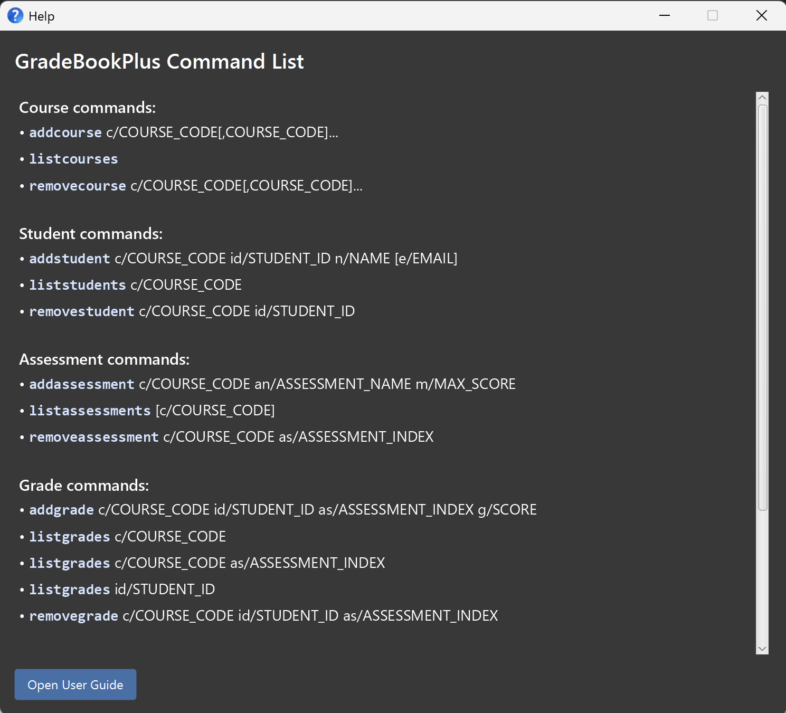
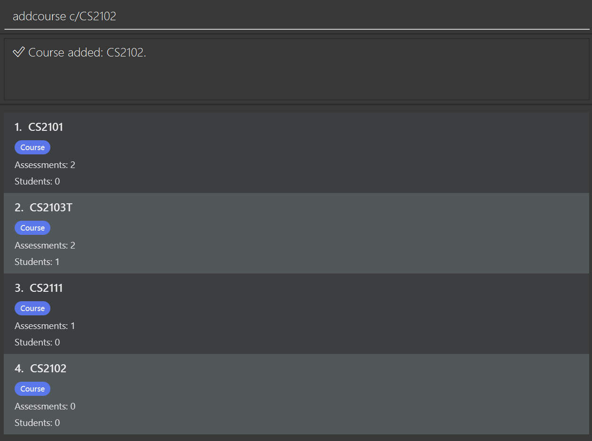
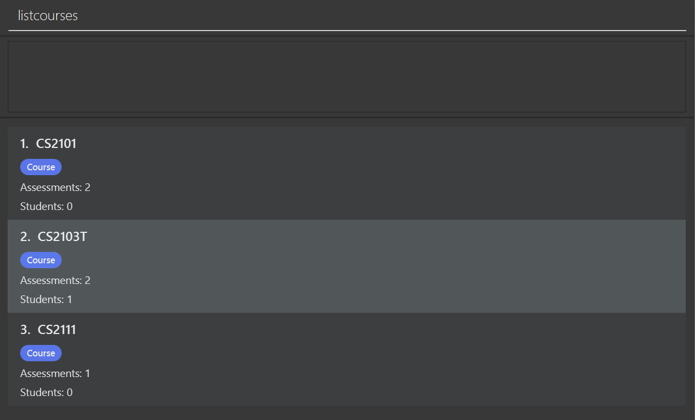
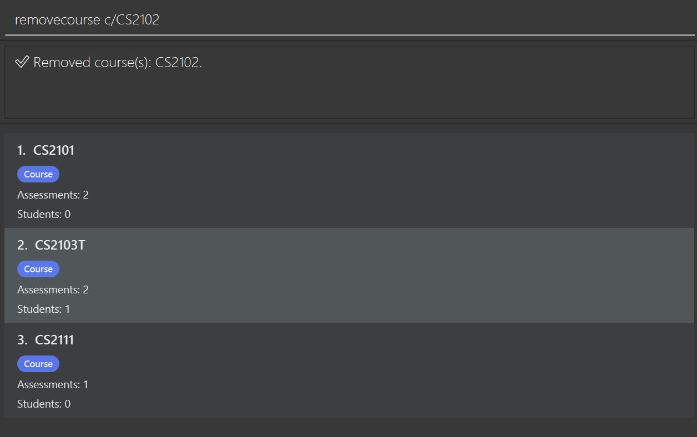
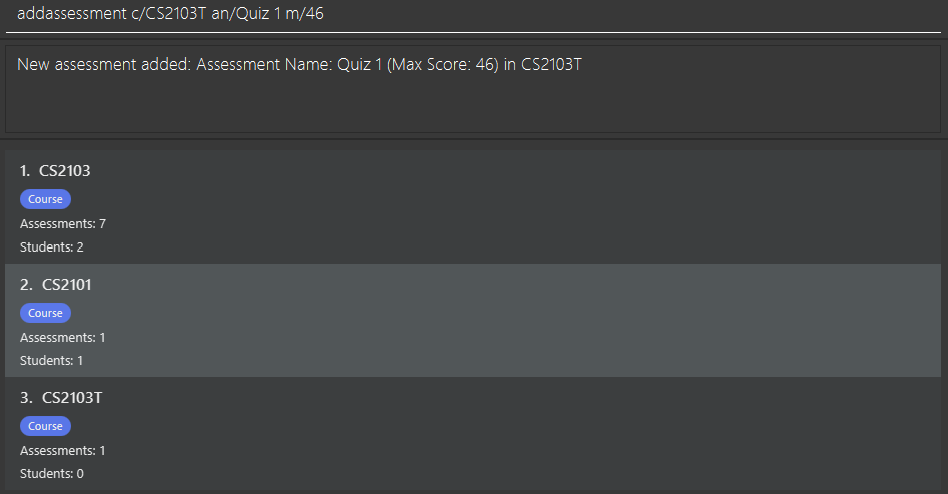
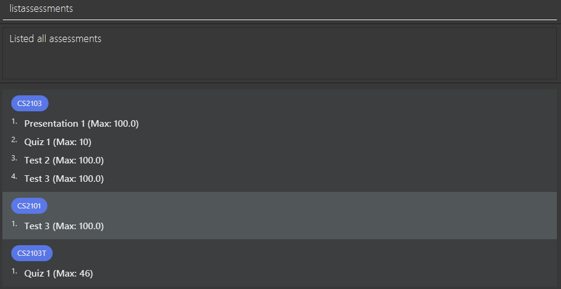
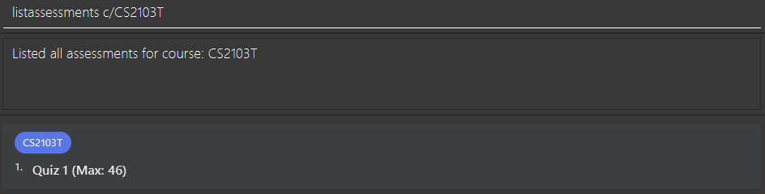
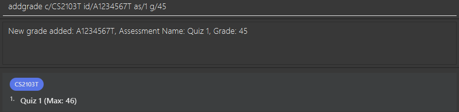
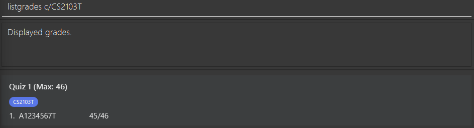
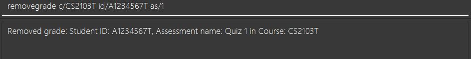

# GradeBookPlus User Guide

GradeBookPlus is a **desktop gradebook application** for managing courses, students, assessments, and grades. It is optimized for use via a **Command Line Interface** while still providing a **Graphical User Interface** for viewing data clearly.

If you prefer typing commands quickly, GradeBookPlus helps you manage class records faster than clicking through menus.

* Table of Contents
{:toc}

--------------------------------------------------------------------------------------------------------------------

## Quick start

1. Ensure you have **Java 17 or above** installed on your computer.

2. Download the latest `.jar` file from your team’s release page.

3. Copy the `.jar` file into the folder you want to use as the app’s home folder.

4. Open a terminal in that folder and run:

   `java -jar gradebookplus.jar`

5. Wait a few seconds for the application window to appear.

6. Type commands into the command box and press Enter to execute them.

Some example commands you can try:

* `addcourse c/CS2103T`
* `addstudent c/CS2103T id/A0123456X n/Alex Yeoh e/alex@example.com`
* `addassessment c/CS2103T an/Quiz 1 m/10`
* `addgrade c/CS2103T id/A0123456X as/1 g/8`
* `listgrades c/CS2103T`

--------------------------------------------------------------------------------------------------------------------

## Features

**Notes about the command format:** 

* Words in `UPPER_CASE` are parameters to be supplied by the user. 
  e.g. in `addcourse c/COURSE_CODE`, `COURSE_CODE` is a parameter.

* Items in square brackets are optional. 
  e.g. `addstudent c/COURSE_CODE id/STUDENT_ID n/NAME [e/EMAIL]`

* Parameters can be in any order unless stated otherwise.

* Course codes are case-insensitive. 
  e.g. `c/cs2103t` and `c/CS2103T` are treated as the same course.

* Assessment indexes refer to the indexes shown in the displayed assessment list for that course.

### Viewing help: `help`

**Purpose:** Use this command to open the Help window for a quick reference to GradeBookPlus commands.

Opens the Help window, which displays a summary of supported commands and their usage.

Format: `help`

Example:
* `help`

Expected outcome:
* The Help window opens.
* You can refer to the listed commands without leaving the app.

---

## Course management

### Adding a course: `addcourse`

**Purpose:** Use this command to create one or more courses before adding students, assessments, or grades to them.

Adds one or more courses to the database.

Format: `addcourse c/COURSE_CODE[,COURSE_CODE,...]`

Examples:
* `addcourse c/CS2103T`
* `addcourse c/CS2103T, CS2101, CS2102`

### Listing all courses: `listcourses`

**Purpose:** Use this command to view all courses currently stored in GradeBookPlus.

Lists all existing courses.

Format: `listcourses`

Examples:
* `listcourses`

### Removing a course: `removecourse`

**Purpose:** Use this command to delete one or more courses that are no longer needed, together with their associated student and assessment records.

Removes one or more courses using course code.

Format: `removecourse c/COURSE_CODE[,COURSE_CODE,...]`

Example:
* `removecourse c/CS2103T`
* `removecourse c/CS2103T, cs2102`

> Removing a course also removes all students and assessments associated with that course.

---

## Student management

### Adding a student to a course: `addstudent`

**Purpose:** Use this command to enroll a student into a specific course so that their grades can be recorded later.

Adds a student to a course roster.

Format: `addstudent c/COURSE_CODE id/STUDENT_ID n/NAME [e/EMAIL]`

Examples:
* `addstudent c/CS2103T id/A0123456X n/Alex Yeoh`
* `addstudent c/CS2103T id/A0123456X n/Alex Yeoh e/alex@example.com`

### Listing students in a course: `liststudents`

**Purpose:** Use this command to see all students currently enrolled in a specific course.

Lists all students enrolled in the specified course.

Format: `liststudents c/COURSE_CODE`

Examples:
* `liststudents c/CS2103T`

### Removing a student from a course: `removestudent`

**Purpose:** Use this command to remove a student from a course roster when they are no longer taking that course.

Removes a student from the specified course.

Format: `removestudent c/COURSE_CODE id/STUDENT_ID`

Examples:
* `removestudent c/CS2103T id/A0123456X`

---

## Assessment management

### Adding an assessment: `addassessment`

**Purpose:** Use this command to create an assessment for a course so that grades can be recorded against it.

Adds an assessment to a course.

Format: `addassessment c/COURSE_CODE an/ASSESSMENT_NAME m/MAX_SCORE`

Examples:
* `addassessment c/CS2103T an/Quiz 1 m/10`
* `addassessment c/CS2103T an/Final Exam m/100`

### Listing assessments: `listassessments`

**Purpose:** Use this command to view all assessments, either across all courses or within one specific course.

Lists all assessments, optionally filtered by course.

Format:
* `listassessments`
* `listassessments c/COURSE_CODE`

Examples:
* `listassessments`
* `listassessments c/CS2103T`

### Removing an assessment: `removeassessment`

**Purpose:** Use this command to delete an assessment from a course when it is no longer needed or was added by mistake.

Removes an assessment from a course using its displayed index.

Format: `removeassessment c/COURSE_CODE as/ASSESSMENT_INDEX`

Example:
* `removeassessment c/CS2103T as/1`

> Removing an assessment also removes all grades associated with that assessment.

---

## Grade management

### Adding a grade: `addgrade`

**Purpose:** Use this command to record a student’s score for a specific assessment in a course.

Adds a grade for a student in a course assessment.

Format: `addgrade c/COURSE_CODE id/STUDENT_ID as/ASSESSMENT_INDEX g/SCORE`

Examples:
* `addgrade c/CS2103T id/A0123456X as/1 g/8`
* `addgrade c/CS2103T id/A0123456X as/2 g/85`

> The student must already be enrolled in the course. 
> The score cannot exceed the assessment’s max score.

### Listing grades: `listgrades`

**Purpose:** Use this command to view recorded grades by course, by assessment, or by student.

Lists grades by course, by assessment within a course, or by student ID.

Format:
* `listgrades c/COURSE_CODE`
* `listgrades c/COURSE_CODE as/ASSESSMENT_INDEX`
* `listgrades id/STUDENT_ID`

Examples:
* `listgrades c/CS2103T`
* `listgrades c/CS2103T as/1`
* `listgrades id/A0123456X`

### Removing a grade: `removegrade`

**Purpose:** Use this command to delete an incorrect or outdated grade entry for a student’s assessment.

Removes a grade for a student from a course assessment.

Format: `removegrade c/COURSE_CODE id/STUDENT_ID as/ASSESSMENT_INDEX`

Example:
* `removegrade c/CS2103T id/A0123456X as/1`

---

## Other commands

### Viewing detailed course information: `listdetails`

**Purpose:** Use this command to view a course’s detailed information, including its students and assessments, in one place.

Displays detailed information for a course.

Format: `listdetails c/COURSE_CODE`

Example:
* `listdetails c/CS2103T`

### Exporting a course: `exportcourse`

**Purpose:** Use this command to export the records of a course for external viewing, sharing, or backup.

Exports course-related information.

Format: `exportcourse c/COURSE_CODE`

Example:
* `exportcourse c/CS2103T`

### Viewing all main lists: `viewall`

**Purpose:** Use this command to return to the default overall view and get a quick summary of the stored data.

Returns the app to the default overall view.

Format: `viewall`

### Exiting the program: `exit`

**Purpose**: Use this command to close GradeBookPlus safely.

Exits the application.

Format: `exit`

--------------------------------------------------------------------------------------------------------------------

## FAQ

**Q:** How do I move my data to another computer? 
**A:** Copy the data file from the old computer into the data folder used by GradeBookPlus on the new computer.

**Q:** Where is my data stored? 
**A:** Data is stored automatically in the app’s data folder as a JSON file.

--------------------------------------------------------------------------------------------------------------------

## Known issues

1. If you move the application between multiple monitors, the window may reopen off-screen. Delete `preferences.json` and relaunch the app.
2. If the Help window is minimized, reopening help may not restore it automatically. Restore it manually.

--------------------------------------------------------------------------------------------------------------------

## Command summary

Action | Format
--------|------------------
**Add course** | `addcourse c/COURSE_CODE[,COURSE_CODE]...`
**List courses** | `listcourses`
**Remove course** | `removecourse c/COURSE_CODE[,COURSE_CODE]...`
**Add student** | `addstudent c/COURSE_CODE id/STUDENT_ID n/NAME [e/EMAIL]`
**List students** | `liststudents c/COURSE_CODE`
**Remove student** | `removestudent c/COURSE_CODE id/STUDENT_ID`
**Add assessment** | `addassessment c/COURSE_CODE an/ASSESSMENT_NAME m/MAX_SCORE`
**List assessments** | `listassessments [c/COURSE_CODE]`
**Remove assessment** | `removeassessment c/COURSE_CODE as/ASSESSMENT_INDEX`
**Add grade** | `addgrade c/COURSE_CODE id/STUDENT_ID as/ASSESSMENT_INDEX g/SCORE`
**Remove grade** | `removegrade c/COURSE_CODE id/STUDENT_ID as/ASSESSMENT_INDEX`
**List grades** | `listgrades c/COURSE_CODE` / `listgrades c/COURSE_CODE as/ASSESSMENT_INDEX` / `listgrades id/STUDENT_ID`
**List details** | `listdetails c/COURSE_CODE`
**Export course** | `exportcourse c/COURSE_CODE`
**View all** | `viewall`
**Help** | `help`
**Exit** | `exit`
