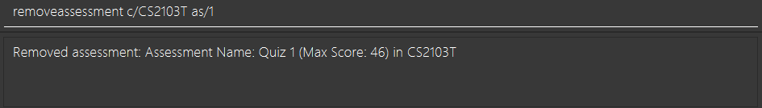
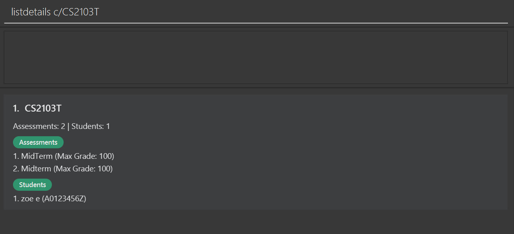

<style>
  h2 {
    margin-top: 1.1rem;
    margin-bottom: 0.3rem;
  }

  h3 {
    margin-top: 0.75rem;
    margin-bottom: 0.2rem;
  }

  p, ul, ol {
    margin-top: 0.2rem;
    margin-bottom: 0.45rem;
  }

  li {
    margin-bottom: 0.12rem;
  }

  hr {
    margin: 0.75rem 0;
  }

  img {
    display: block;
    margin: 0.45rem auto 0.7rem;
    max-width: 100%;
    height: auto;
  }

  @media print {
    .page-break {
      page-break-before: always;
      break-before: page;
    }

    h2, h3 {
      page-break-after: avoid;
      break-after: avoid-page;
    }

    img, table, pre, blockquote, .alert {
      page-break-inside: avoid;
      break-inside: avoid;
    }

    p, li {
      orphans: 3;
      widows: 3;
    }

    h2 {
      margin-top: 0.65rem !important;
      margin-bottom: 0.2rem !important;
    }

    h3 {
      margin-top: 0.5rem !important;
      margin-bottom: 0.15rem !important;
    }

    p, ul, ol {
      margin-top: 0.12rem !important;
      margin-bottom: 0.32rem !important;
    }

    li {
      margin-bottom: 0.08rem !important;
    }

    hr {
      margin: 0.45rem 0 0.6rem !important;
    }

    img {
      margin: 0.35rem auto 0.55rem !important;
    }
  }
</style>

# GradeBookPlus User Guide

GradeBookPlus is a **desktop gradebook application** for managing **courses, students, assessments, and grades**. It is optimized for users who prefer a **Command Line Interface (CLI)** for speed, while still providing a **Graphical User Interface (GUI)** to display records clearly.

GradeBookPlus is designed for **educators, teaching assistants, and student leaders** who need to manage course records quickly and accurately. It is most suitable for users who are comfortable with basic computer operations such as downloading files and typing short commands, but it **does not assume prior knowledge of Java or terminal commands**.

If you prefer typing commands instead of clicking through menus, GradeBookPlus can help you update class records faster and with less repetition.

* Table of Contents
{:toc}

--------------------------------------------------------------------------------------------------------------------

## Who this guide is for

This guide is written for users who:

* manage course rosters, assessments, and grades regularly
* prefer keyboard-based workflows for repetitive tasks
* may be new to Java setup or the terminal
* want quick command references without reading technical documentation

### Assumptions about users

This guide assumes that you:

* know how to download a file from a browser
* can create or open a folder on your computer
* can copy and paste text

This guide does **not** assume that you already know:

* how to check your Java version
* what a terminal is
* how to run a `.jar` file

--------------------------------------------------------------------------------------------------------------------
<div class="page-break"></div>

## Quick start

Follow these steps the first time you use GradeBookPlus.

### Step 1: Check whether Java 17 or above is installed

GradeBookPlus requires **Java 17 or above**.

On **Windows**:

1. Press the **Windows key**.
2. Type **Command Prompt** or **PowerShell**.
3. Open the app.
4. Type `java -version` and press **Enter**.

On **macOS**:

1. Press **Command + Space**.
2. Type **Terminal**.
3. Open the app.
4. Type `java -version` and press **Return**.

**Expected outcome:**

* If you see a version number such as `17`, `18`, `21`, or higher, your computer is ready.
* If you see an error saying Java is not installed or the command is not recognized, install Java 17 or above before continuing.

<div markdown="block" class="alert alert-info">

**What is a terminal?**

A terminal is a text-based window where you type commands for your computer.
On Windows, this is usually **Command Prompt** or **PowerShell**.
On macOS, this is usually **Terminal**.

</div>

### Step 2: Download the app

1. Download the latest `.jar` file from your team’s release page.
2. Create a folder for GradeBookPlus.
3. Move the downloaded `.jar` file into that folder.

### Step 3: Open the folder in a terminal

On **Windows**:

1. Open the folder containing `GradeBookPlus.jar`.
2. Click the address bar in File Explorer.
3. Type `powershell` and press **Enter**.

On **macOS**:

1. Open **Terminal**.
2. Type `cd ` (including the space after `cd`).
3. Drag your GradeBookPlus folder into the Terminal window.
4. Press **Return**.

### Step 4: Run GradeBookPlus

Type the following command and press **Enter**:

```bash
java -jar GradeBookPlus.jar
```

**Expected outcome:**

* The GradeBookPlus window appears after a few seconds.
* You should see the command input box where you can type commands.

### Step 5: Try your first commands

Type each command below and press **Enter** after each one:

```text
addcourse c/CS2103T
addstudent c/CS2103T id/A0123456X n/Alex Yeoh e/alex@example.com
addassessment c/CS2103T an/Quiz 1 m/10
addgrade c/CS2103T id/A0123456X as/1 g/8
listgrades c/CS2103T
```

**Expected outcome:**

* a course named `CS2103T` is added
* a student is added to that course
* an assessment named `Quiz 1` is added
* a grade is recorded for that student
* the recorded grade is displayed in the GUI

### Overview of the UI

GradeBookPlus has a GUI that helps you confirm the results of the commands you enter.

The main window contains:

* a **command box** where you type commands
* a **result display** where success or error messages appear
* a **main list panel** where courses, students, assessments, or grades are shown depending on the command used

<div markdown="block" class="alert alert-success">

**Tip:**

When learning the app for the first time, alternate between an `add...` command and a `list...` command.
This makes it easier to confirm that the data shown in the GUI matches the command you entered.

</div>

--------------------------------------------------------------------------------------------------------------------

## Features

<div markdown="block" class="alert alert-info">

**Notes about the command format:**

* Words in `UPPER_CASE` are parameters to be supplied by the user.
  e.g. in `addcourse c/COURSE_CODE`, `COURSE_CODE` is a parameter.
* Items in square brackets are optional.
  e.g. `addstudent c/COURSE_CODE id/STUDENT_ID n/NAME [e/EMAIL]`
* Parameters can be in any order unless stated otherwise.
* Course codes are case-insensitive.
  e.g. `c/cs2103t` and `c/CS2103T` are treated as the same course.
* Assessment indexes refer to the indexes shown in the displayed assessment list for that course.

</div>

<div markdown="1" class="command-section">

### Viewing help: `help`

**Purpose:** Use this command to open the Help window for a quick reference to GradeBookPlus commands.

Opens the Help window, which displays a summary of supported commands and their usage.

**Format:** `help`

**Example:**

* `help`

**Expected outcome:**

* The Help window opens.
* You can refer to the listed commands without leaving the app.


</div>

---

## Course management

<div markdown="1" class="command-section">

### Adding a course: `addcourse`

**Purpose:** Use this command to create one or more courses before adding students, assessments, or grades to them.

Adds one or more courses to the database.

**Format:** `addcourse c/COURSE_CODE[,COURSE_CODE,...]`

**Examples:**

* `addcourse c/CS2103T`
* `addcourse c/CS2103T, CS2101, CS2102`

**Expected outcome:**

* The specified course or courses are added.
* The updated course list is shown in the GUI.

<div markdown="block" class="alert alert-success">

**Tip:**

Add all your course codes first before adding students or assessments.
This reduces repeated switching between courses during setup.

</div>


</div>

<div markdown="1" class="command-section">

### Listing all courses: `listcourses`

**Purpose:** Use this command to view all courses currently stored in GradeBookPlus.

Lists all existing courses.

**Format:** `listcourses`

**Example:**

* `listcourses`

**Expected outcome:**

* All stored courses are displayed in the main list panel.


</div>

<div markdown="1" class="command-section">

### Removing a course: `removecourse`

**Purpose:** Use this command to delete one or more courses that are no longer needed, together with their associated student and assessment records.

Removes one or more courses using course code.

**Format:** `removecourse c/COURSE_CODE[,COURSE_CODE,...]`

**Examples:**

* `removecourse c/CS2103T`
* `removecourse c/CS2103T, cs2102`

**Expected outcome:**

* The specified course or courses are removed.
* The updated course list is shown.

<div markdown="block" class="alert alert-warning">

**Warning:**

Removing a course also removes all students, assessments, and grades associated with that course.
Use this command only when you are sure the course record is no longer needed.

</div>


</div>

---

## Student management

<div markdown="1" class="command-section">

### Adding a student to a course: `addstudent`

**Purpose:** Use this command to enroll a student into a specific course so that their grades can be recorded later.

Adds a student to a course roster.

**Format:** `addstudent c/COURSE_CODE id/STUDENT_ID n/NAME [e/EMAIL]`

**Examples:**

* `addstudent c/CS2103T id/A0123456X n/Alex Yeoh`
* `addstudent c/CS2103T id/A0123456X n/Alex Yeoh e/alex@example.com`

**Expected outcome:**

* The student is added to the specified course.
* The updated roster is shown when you run `liststudents c/COURSE_CODE`.

**Notes:**

* `STUDENT_ID` must follow the format: one letter `A`, followed by exactly 7 digits, followed by one uppercase letter (e.g. `A0123456X`).
* `NAME` must contain only letters, spaces, and the characters `. , ' / -`. Names with `s/o` or `d/o` are supported. The name must be between 2 and 60 characters long.
* `EMAIL`, if provided, must be a valid address containing a domain with at least one dot (e.g. `user@example.com`). The local part (before `@`) may only contain alphanumeric characters and the special characters `+`, `_`, `.`, `-`. Characters such as `!`, `#`, `$`, `%`, `^`, `&` are not accepted.

<div markdown="block" class="alert alert-success">

**Tip:**

Include the email address when available. This makes exported course records more complete later.

</div>

</div>

<div markdown="1" class="command-section">

### Listing students in a course: `liststudents`

**Purpose:** Use this command to see all students currently enrolled in a specific course.

Lists all students enrolled in the specified course.

**Format:** `liststudents c/COURSE_CODE`

**Example:**

* `liststudents c/CS2103T`

**Expected outcome:**

* All students in the specified course are displayed.

</div>

<div markdown="1" class="command-section">

### Removing a student from a course: `removestudent`

**Purpose:** Use this command to remove a student from a course roster when they are no longer taking that course.

Removes a student from the specified course.

**Format:** `removestudent c/COURSE_CODE id/STUDENT_ID`

**Example:**

* `removestudent c/CS2103T id/A0123456X`

**Expected outcome:**

* The student is removed from the specified course.

<div markdown="block" class="alert alert-warning">

**Warning:**

Removing a student also removes all grades associated with that student in the course.

</div>

</div>

---

<div class="page-break"></div>

## Assessment management

<div markdown="1" class="command-section">

### Adding an assessment: `addassessment`

**Purpose:** Use this command to create an assessment for a course so that grades can be recorded against it.

Adds an assessment to a course.

**Format:** `addassessment c/COURSE_CODE an/ASSESSMENT_NAME m/MAX_SCORE`

**Examples:**

* `addassessment c/CS2103T an/Quiz 1 m/10`
* `addassessment c/CS2103T an/Final Exam m/100`

**Expected outcome:**

* The assessment is added to the specified course.
* The new assessment appears when you run `listassessments c/COURSE_CODE`.

**Notes:**

* The course must already exist.
* Assessment names cannot be blank and must be at most 50 characters long.
* Maximum score must be greater than 0 and at most 999, with at most 1 decimal place.
* The same assessment cannot be added twice to the same course. Assessment names are compared after ignoring case and spaces.
  For example, `Quiz 1`, `quiz   1`, and `QUIZ1` are considered the same assessment name in the same course.

<div markdown="block" class="alert alert-success">

**Tip:**

Use short, consistent assessment names such as `Quiz 1`, `Midterm`, and `Final Exam`.
This makes exported files and grade listings easier to read.

</div>


</div>

<div markdown="1" class="command-section">

### Listing assessments: `listassessments`

**Purpose:** Use this command to view all assessments, either across all courses or within one specific course.

Lists all assessments, optionally filtered by course.

**Format:**

* `listassessments`
* `listassessments c/COURSE_CODE`

**Examples:**

* `listassessments`
* `listassessments c/CS2103T`

**Expected outcome:**

* All assessments are displayed, or only the assessments for the specified course if a filter is used.

**Notes:**

* If a course code is provided, the course must already exist.
* If no matching assessments are found, the app displays a message instead of an empty result.

<div markdown="block" class="alert alert-success">

**Tip:**

Run `listassessments c/COURSE_CODE` before using `addgrade` or `removeassessment` so that you can confirm the correct assessment index.

</div>


</div>

<div markdown="1" class="command-section">

### Removing an assessment: `removeassessment`

**Purpose:** Use this command to delete an assessment from a course when it is no longer needed or was added by mistake.

Removes an assessment from a course using its displayed index.

**Format:** `removeassessment c/COURSE_CODE as/ASSESSMENT_INDEX`

**Example:**

* `removeassessment c/CS2103T as/1`

**Expected outcome:**

* The assessment is removed from the specified course.

**Notes:**

* The course must already exist.
* The assessment index must be a non-zero unsigned integer shown in the assessment list for that course.

<div markdown="block" class="alert alert-warning">

**Warning:**

Removing an assessment also removes all grades associated with that assessment.

</div>



</div>

---

<div class="page-break"></div>

## Grade management

<div markdown="1" class="command-section">

### Adding a grade: `addgrade`

**Purpose:** Use this command to record a student’s score for a specific assessment in a course.

Adds a grade for a student in a course assessment.

**Format:** `addgrade c/COURSE_CODE id/STUDENT_ID as/ASSESSMENT_INDEX g/SCORE`

**Examples:**

* `addgrade c/CS2103T id/A0123456X as/1 g/8`
* `addgrade c/CS2103T id/A0123456X as/2 g/85`

**Expected outcome:**

* The grade is added to the student’s record.
* The result message confirms the student, assessment, and score.

**Notes:**

* The course must already exist.
* The student must already be enrolled in the course.
* The assessment index must refer to an assessment in the specified course.
* The score must be 0 or above, at most 999, and have at most 1 decimal place.
* The score cannot exceed the assessment’s max score.
* A student can have only one grade for the same assessment. To change a score, remove the existing grade first and add the new grade.

<div markdown="block" class="alert alert-success">

**Tip:**

If you are entering several grades for one course, keep the relevant `listassessments c/COURSE_CODE` output visible so that you can reuse the correct assessment indexes.

</div>


</div>

<div markdown="1" class="command-section">

### Listing grades: `listgrades`

**Purpose:** Use this command to view recorded grades by course, by assessment, or by student.

Lists grades by course, by assessment within a course, or by student ID.

**Format:**

* `listgrades c/COURSE_CODE`
* `listgrades c/COURSE_CODE as/ASSESSMENT_INDEX`
* `listgrades id/STUDENT_ID`

**Examples:**

* `listgrades c/CS2103T`
* `listgrades c/CS2103T as/1`
* `listgrades id/A0123456X`

**Expected outcome:**

* Matching grades are displayed in the GUI.
* If no matching grades are found, the app shows a message instead of an empty result.

**Notes:**

* Use either `id/STUDENT_ID` alone, or `c/COURSE_CODE` with an optional `as/ASSESSMENT_INDEX`.
* If a course code is provided, the course must already exist.
* If an assessment index is provided, it must refer to an assessment in the specified course.
* Only students with grades added will be listed.


</div>

<div markdown="1" class="command-section">

### Removing a grade: `removegrade`

**Purpose:** Use this command to delete an incorrect or outdated grade entry for a student’s assessment.

Removes a grade for a student from a course assessment.

**Format:** `removegrade c/COURSE_CODE id/STUDENT_ID as/ASSESSMENT_INDEX`

**Example:**

* `removegrade c/CS2103T id/A0123456X as/1`

**Expected outcome:**

* The specified grade is removed.
* The result message confirms the affected student and assessment.

**Notes:**

* The course must already exist.
* The student must already be enrolled in the course.
* The assessment index must refer to an assessment in the specified course.
* The grade must already exist.


</div>

---

<div class="page-break"></div>

## Other commands

<div markdown="1" class="command-section">

### Viewing detailed course information: `listdetails`

**Purpose:** Use this command to view a course’s detailed information, including its students and assessments, in one place.

Displays assessments and students information for one or more courses.

**Format:** `listdetails c/COURSE_CODE[,COURSE_CODE,...]`

**Examples:**

* `listdetails c/CS2103T`
* `listdetails c/CS2103T, CS2101`

**Expected outcome:**

* The selected course details are displayed together so that you can review students and assessments without running multiple commands.



</div>

<div markdown="1" class="command-section">

### Exporting a course: `exportcourse`

**Purpose:** Use this command to export the records of a course for external viewing, sharing, or backup.

Exports all students, assessments, and grades for a course to a CSV file.

**Format:** `exportcourse c/COURSE_CODE`

**Example:**

* `exportcourse c/CS2103T`

**Expected outcome:**

* A CSV file for the specified course is created in the folder where the app was launched.

**Notes:**

* The output file is saved as `<COURSE_CODE>.csv` (e.g. `CS2103T.csv`) in the folder from which the app was launched.
* The CSV contains one row per student, with columns: `Student ID`, `Name`, `Email`, followed by one column per assessment (with its max score shown in the header).
* Cells for assessments where a grade has not been recorded are left empty.
* The file is overwritten each time the command is run for the same course.

<div markdown="block" class="alert alert-warning">

**Warning:**

Running `exportcourse` again for the same course replaces the previous CSV file with a new one.

</div>

</div>

<div markdown="1" class="command-section">

### Viewing overall summary: `viewall`

**Purpose:** Use this command to view a quick summary of the current assessment and grade data.

Displays an overview summary of the current assessment and grade data.

**Format:** `viewall`

**Example:**

* `viewall`

**Expected outcome:**

* Displays the total number of assessments currently stored in the app.
* Displays the total number of grades currently stored in the app.
* Displays the number of grades recorded for each assessment.

**Typical usage:**

* Use `viewall` after adding or removing assessments to confirm that the assessment count has updated as expected.
* Use `viewall` after adding or removing grades to quickly verify that the overall grade count has changed.
* Use `viewall` when you want a quick summary without manually switching through multiple list commands.

**Notes:**

* `viewall` is intended as a lightweight overview command rather than a full detailed report.
* The command is useful for quickly checking whether recent updates to assessment and grade records have been reflected in the system.
* In an empty state, `viewall` still provides a quick way to confirm that there are currently no assessments or grades recorded.

</div>

<div markdown="1" class="command-section">

### Exiting the program: `exit`

**Purpose:** Use this command to close GradeBookPlus safely.

Exits the application.

**Format:** `exit`

**Expected outcome:**

* The application closes.

</div>

--------------------------------------------------------------------------------------------------------------------

<div class="page-break"></div>

## FAQ

<div markdown="1" class="faq-item">

**How do I move my data to another computer?**

Copy the data file from the old computer into the data folder used by GradeBookPlus on the new computer.

</div>

<div markdown="1" class="faq-item">

**Where is my data stored?**

Data is stored automatically in the app’s data folder as a JSON file.

</div>

<div markdown="1" class="faq-item">

**Where is the CSV file saved when I use `exportcourse`?**

The file is saved as `COURSE_CODE.csv` (e.g. `CS2103T.csv`) in the folder where you launched the app (that is, the working directory).

</div>

<div markdown="1" class="faq-item">

**Why does `removeassessment` or `removegrade` say the assessment index is invalid?**

Assessment indexes are based on the currently displayed assessment list for the specified course. Run `listassessments c/COURSE_CODE` first, then use the index shown there.

</div>

<div markdown="1" class="faq-item">

**Why can’t I add a grade for a student?**

The student must already be enrolled in that course, the assessment index must exist for that course, and the score must not exceed the assessment max score.

</div>

<div markdown="1" class="faq-item">

**Can the same student be in multiple courses?**

Yes. Students are enrolled per course, so the same student ID can appear in different course rosters.

</div>

<div markdown="1" class="faq-item">

**What happens if I remove a course?**

Removing a course also removes all assessments and grades associated with that course.

</div>

<div markdown="1" class="faq-item">

**What happens if I remove an assessment?**

Removing an assessment also removes all grades tied to that assessment in the same course.

</div>

<div markdown="1" class="faq-item">

**Why do I see `Course ... not found` even though my command format is correct?**

Format checks and data checks are different. A command can be syntactically valid but still fail if the referenced course does not exist in your current data.

</div>

<div markdown="1" class="faq-item">

**Are command keywords and course codes case-sensitive?**

Command keywords should be typed as documented. Course codes are case-insensitive. For example, `cs2103t` and `CS2103T` refer to the same course.

</div>

<div markdown="1" class="faq-item">

**What does `No grades found` or `No assessments found` mean?**

The command ran successfully, but there are no matching records for the filter you requested.

</div>

<div markdown="1" class="faq-item">

**Why does adding an assessment fail with `This assessment already exists`?**

GradeBookPlus rejects duplicate assessment names in the same course after ignoring case and spaces. For example, if `Quiz 1` already exists in `CS2103T`, adding `quiz   1` or `QUIZ1` to `CS2103T` will fail.

</div>

<div markdown="1" class="faq-item">

**When should I use `viewall` instead of the other list commands?**

Use `viewall` when you want a quick summary of overall assessment and grade data. Use `liststudents`, `listassessments`, and `listgrades` when you need more detailed records.

</div>

--------------------------------------------------------------------------------------------------------------------

## Known issues

1. If you move the application between multiple monitors, the window may reopen off-screen. Delete `preferences.json` and relaunch the app.
2. If the Help window is minimized, reopening `help` may not restore it automatically. Restore it manually.

--------------------------------------------------------------------------------------------------------------------

<div class="page-break"></div>

<div markdown="1" class="keep-together">

## Command summary

Action | Format
--------|--------
**Add course** | `addcourse c/COURSE_CODE[,COURSE_CODE]...`
**List courses** | `listcourses`
**Remove course** | `removecourse c/COURSE_CODE[,COURSE_CODE]...`
**Add student** | `addstudent c/COURSE_CODE id/STUDENT_ID n/NAME [e/EMAIL]`
**List students** | `liststudents c/COURSE_CODE`
**Remove student** | `removestudent c/COURSE_CODE id/STUDENT_ID`
**Add assessment** | `addassessment c/COURSE_CODE an/ASSESSMENT_NAME m/MAX_SCORE`
**List assessments** | `listassessments [c/COURSE_CODE]`
**Remove assessment** | `removeassessment c/COURSE_CODE as/ASSESSMENT_INDEX`
**Add grade** | `addgrade c/COURSE_CODE id/STUDENT_ID as/ASSESSMENT_INDEX g/SCORE`
**Remove grade** | `removegrade c/COURSE_CODE id/STUDENT_ID as/ASSESSMENT_INDEX`
**List grades** | `listgrades c/COURSE_CODE` / `listgrades c/COURSE_CODE as/ASSESSMENT_INDEX` / `listgrades id/STUDENT_ID`
**List details** | `listdetails c/COURSE_CODE[,COURSE_CODE,...]`
**Export course** | `exportcourse c/COURSE_CODE`
**View all** | `viewall`
**Help** | `help`
**Exit** | `exit`

</div>
